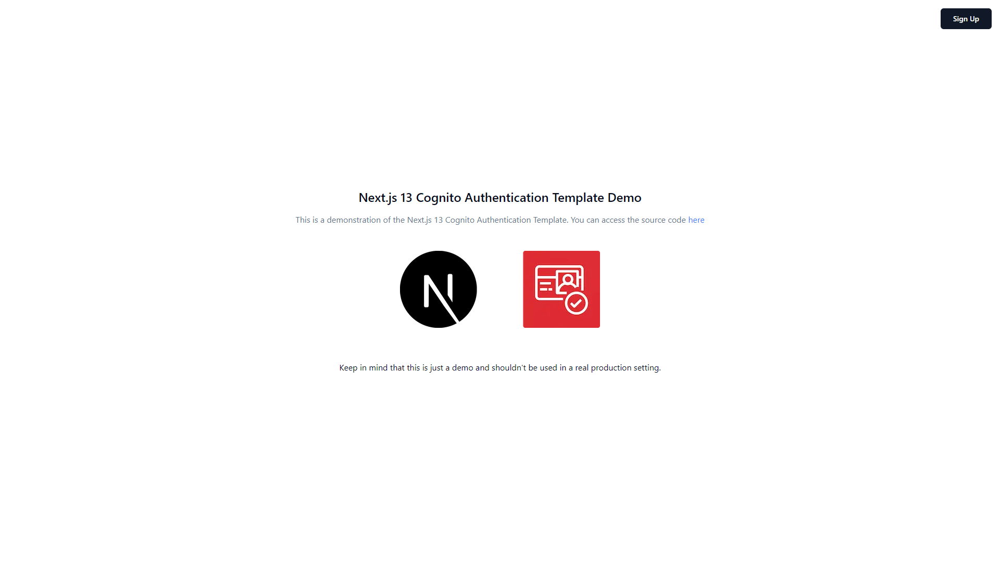
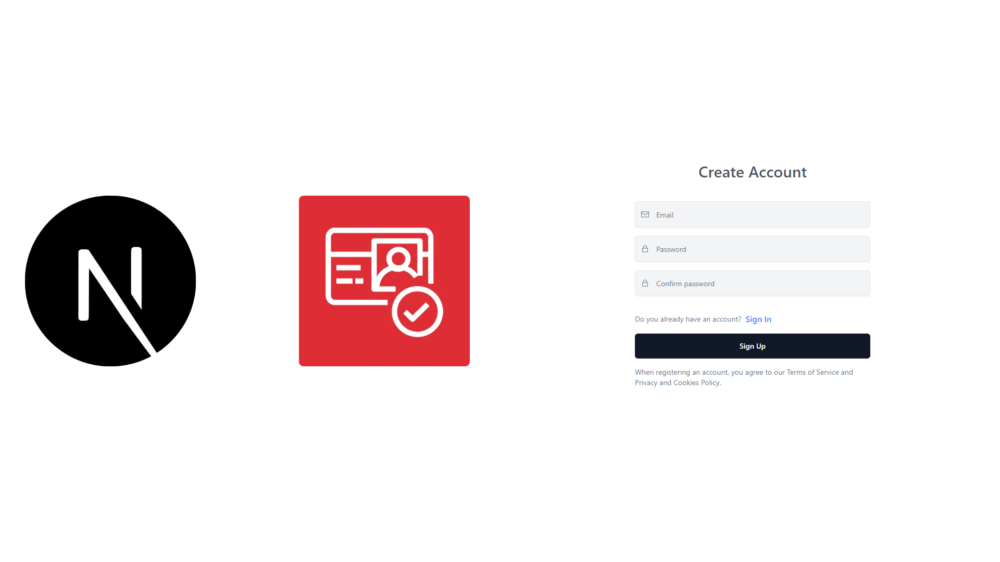
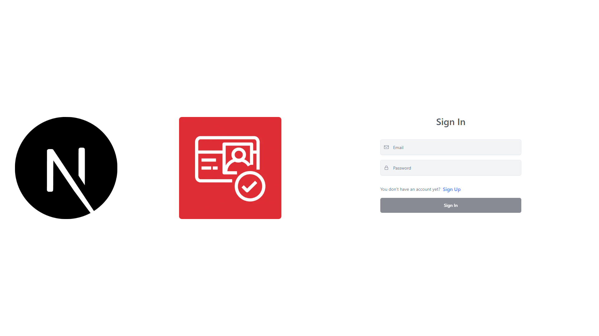
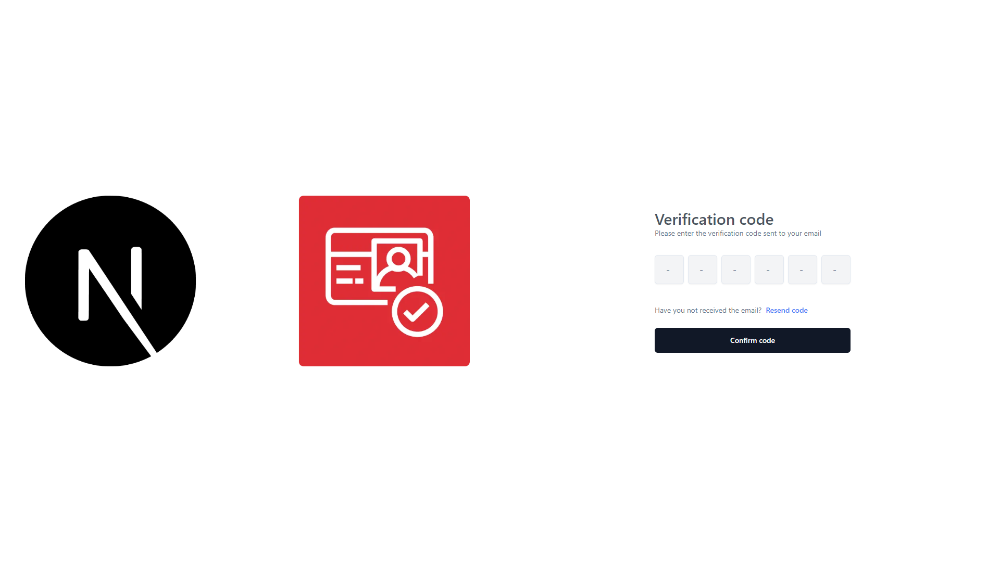
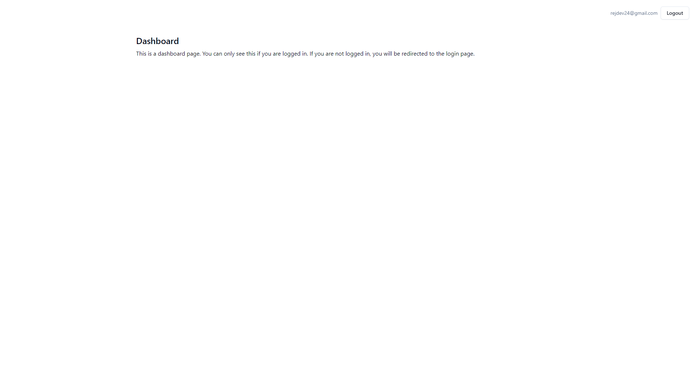

# Next.js 13 + Cognito Custom Authentication Flow 

This is a sample project to demonstrate how to implement a custom authentication flow with `cognito-identity-js`, `Next.js 13`, and `App Router`.

The frontend is built with `Next.js 13`, `Tailwind CSS`, `Shadcn UI`, and `Typescript`.

> 🚨 **Important**: This template is not production-ready. It is intended to be used as a starting point for personal future projects.



## Demo 📺

Demo Website: [Next.js 13 + Cognito custom Authentication Flow](https://main.d2zz6ioqtf0kay.amplifyapp.com/)

## Features ✨

- [x] Sign up 📝
- [x] Sign in 🔑
- [x] Sign out 🚪
- [x] Confirm sign up ✔️
- [x] Resend verification email 📧
- [x] Dashboard protected route 📈
- [ ] Forgot password ❓
- [ ] Change password 🔒
- [ ] Update user attributes 🔄
- [ ] Delete user 🗑️
- [ ] Sign in with Google 📲

## Screenshots 📷

| Sign Up                                  | Sign In                                  | Verify Code                               | Landing                                   | Dashboard                                   |
| ---------------------------------------- | ---------------------------------------- | ----------------------------------------- | ----------------------------------------- | ------------------------------------------- |
|  |  |  |  |  |

## Getting Started 🚀

### 1. Install Dependencies 📦

```bash
npm install
```

### 2. Configure Cognito ⚙️

Create a Cognito User Pool and a Cognito App Client.
Then, configure the following environment variables:

You can follow the steps described in these YouTube videos: [Youtube Playlist by Evan Does Tech](https://www.youtube.com/watch?v=8WZmIdXZe3Q&t=86s)

### next.config.js

```js
const nextConfig = {
    env: {
        UserPoolId: '<YOUR_USER_POOL_ID>',
        ClientId: '<YOUR_CLIENT_ID>',
    }
}

module.exports = nextConfig
```

### 3. Run the Development Server 🏃‍♂️

```bash
npm run dev
```

## References 📚

- [Next.js 13](https://nextjs.org/docs)
- [cognito-identity-js](https://www.npmjs.com/package/amazon-cognito-identity-js)
- [Youtube Playlist by Evan Does Tech](https://www.youtube.com/watch?v=8WZmIdXZe3Q&t=86s)